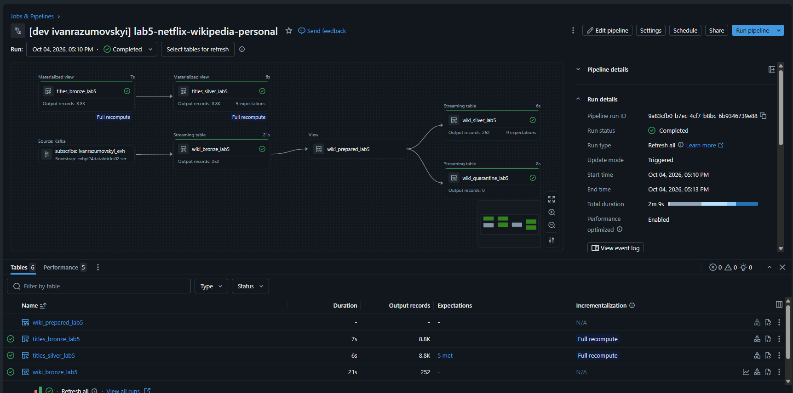
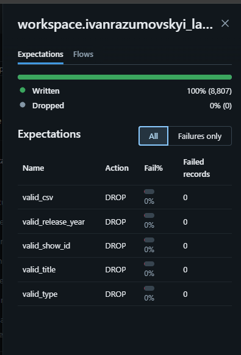
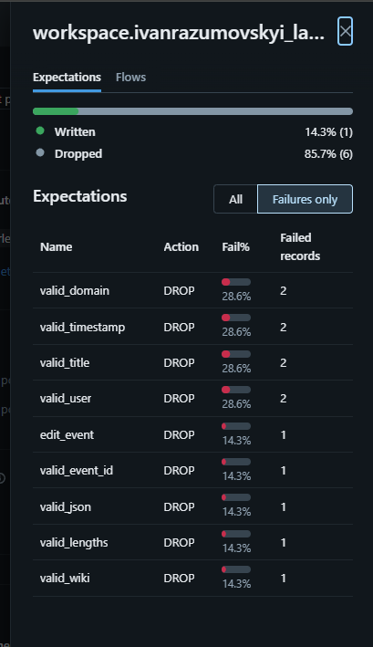

# Lab 5 - Lakeflow Spark Declarative Pipelines

One pipeline with two independent sources, deployed with a Databricks Asset Bundle to Azure Dev and to a personal Free Edition workspace:

- **Netflix CSV** (8,807 rows, batch) -> materialized views
- **Wikipedia edits** from the Azure Event Hub (streaming) -> streaming tables. The producer is the one from Lab 3.

```text
Netflix CSV -> titles_bronze_lab5 (MV) -> titles_silver_lab5 (MV + expectations)

Event Hub -> wiki_bronze_lab5 (raw JSON + Kafka offsets)
              -> wiki_prepared_lab5 (temporary view)
                  -> wiki_silver_lab5 (expectations)
                  -> wiki_quarantine_lab5 (rejected rows + reasons)
```

Rows that break a rule are dropped from Silver by `expect_all_or_drop` and kept in quarantine with the names of the broken rules.
`wiki_bronze_lab5` has `pipelines.reset.allowed=false`: Event Hub deletes old events, so Bronze cannot be rebuilt from the source.

## Project layout

| Path | What it is |
|---|---|
| `databricks.yml` | Bundle: variables and the targets `azure_dev` and `personal` |
| `resources/lab5.pipeline.yml` | Pipeline definition |
| `src/bronze.py`, `silver.py`, `quality_demo.py` | Pipeline datasets |
| `src/lab5/` | Shared code: schemas, quality rules, transformations |
| `notebooks/` | Setup, validation, quality demo, safe reload, classic Spark comparison |
| `producer/` | Wikimedia -> Event Hub producer (copy from Lab 3) |
| `tests/` | Local Spark tests for the shared transformations |
| [CLASSIC_VS_DECLARATIVE.md](CLASSIC_VS_DECLARATIVE.md) | Comparison with classic Spark |

## Targets

| Target | Workspace / compute | Catalog.schema |
|---|---|---|
| `azure_dev` | Azure Dev, classic compute | `dbr_dev.ivanrazumovskyi_lab5` |
| `personal` | Free Edition (profile `personal-env`), serverless | `workspace.ivanrazumovskyi_lab5` |

## Results

Pipeline graph and lineage:



Expectations on `titles_silver_lab5` (clean CSV, nothing dropped) and on the synthetic Wikipedia events from `quality_demo=true` (1 written, 6 dropped):

| Netflix Silver | Wikipedia fixture Silver |
|---|---|
|  |  |

## Local tests

```bash
pip install -r requirements-dev.txt
python tests/test_transforms.py
```
