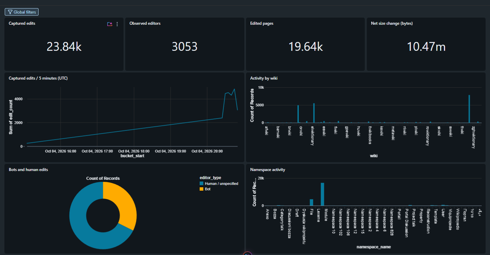
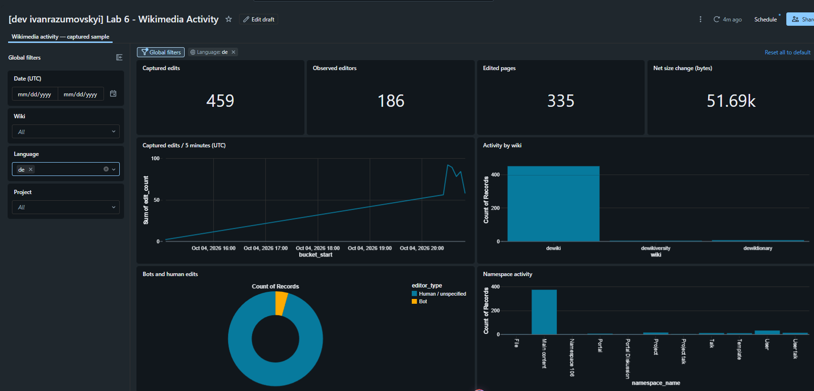
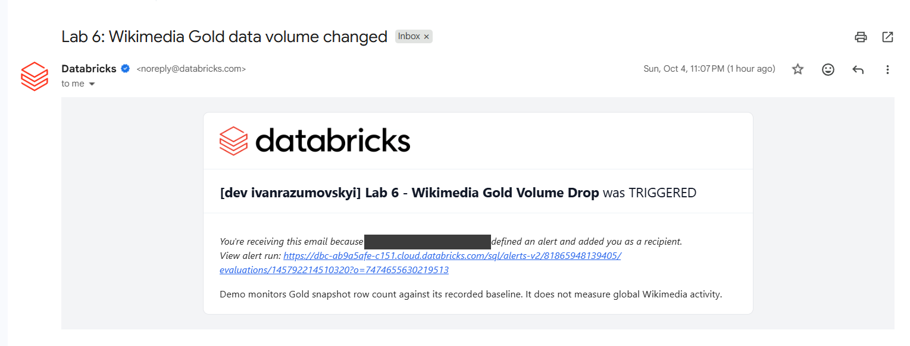
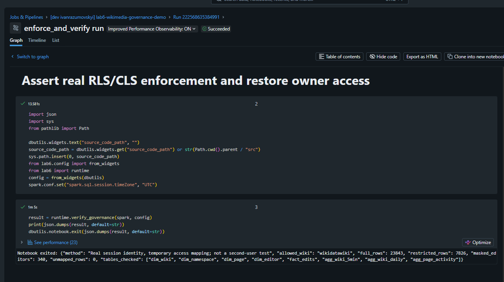

# Lab 6 - Wikimedia Gold layer and business analytics

Gold star schema, AI/BI dashboard, volume-drop alert and row/column security on top of the Lab 5 Wikipedia Silver table.

Business question: **which Wikimedia communities are active, how much editing is automated, and which pages are edited most?**
Metrics describe the captured events, not all Wikimedia traffic.

Lab 5 Silver (`wiki_silver_lab5`) + SiteMatrix snapshot → refresh Job `lab6-wikimedia-gold` → 12 Delta tables → dashboard, alert, RLS/CLS.
Environment setup and security policies are installed by two separate Jobs, so a data refresh never reconfigures the environment.

The Gold tables are built by a Lakeflow Job whose tasks are notebooks, and they are written as ordinary managed Delta tables.
This keeps the build simple (small tables, fully recomputed on each run) and allows row filters and column masks to be set directly on the tables.
Lab 5 is only read from, never changed.

The Job `lab6-wikimedia-gold` has six tasks:

| Task | What it does |
|---|---|
| `reference` | loads the SiteMatrix snapshot into `ref_sitematrix_raw` |
| `gold` | builds the dimensions, `fact_edits` and the three aggregates from Silver |
| `validation` | checks keys, foreign keys, reconciliation, aggregate totals and preserved security policies |
| `volume` | records the current row count in `ops_volume_log` |
| `monitoring_ready` | skips alert evaluation during initial bootstrap |
| `evaluate_volume` | evaluates the existing SQL alert on regular refreshes |

## Deployment, setup and refresh

Bundle deployment creates Job definitions, the dashboard and the paused SQL alert. It does not
load Gold or run setup. Jobs have no automatic triggers.

- `lab6_setup_job` runs `lab6_00_setup.py`: schema, metadata Volume, access mappings and volume history.
- `lab6_governance_job` runs `lab6_03_governance.py`: policy functions, table filters/masks and grants.
- `lab6_gold_job` refreshes data. It checks policies before writing and after building; it never creates or reapplies them.

For a new environment, deploy and run setup, provision a metadata snapshot if API refresh is disabled,
then build Gold with `bootstrap_mode=true`. Bootstrap is accepted only when the schema has no analytical
tables; policy validation is explicitly deferred and the alert task is skipped. Run governance next,
then a regular refresh (`bootstrap_mode=false`, the default) verifies the installed policies and evaluates the alert.
Do not grant reader access or advertise the dashboard as ready until governance has succeeded.
Bootstrap does not revoke pre-existing inherited catalog/schema privileges; use an isolated schema and suitable deployment permissions.

The first bring-up of an environment follows this order:

1. `lab6_setup_job`: schema, Volume and supporting tables.
2. `lab6_gold_job` with `bootstrap_mode=true`: first Gold build.
3. `lab6_governance_job`: functions, row filters, column mask and grants.
4. `lab6_gold_job` as a regular refresh: verifies the policies and evaluates the alert.

Existing environments already have Gold and policies, so use the regular refresh directly.
Setup is idempotent and does not reset existing access mappings or volume history.
Run governance again only when provisioning tables or changing access policies.

### Second Azure trial workspace

The `azure_trial_2` target follows the Lab 5 configuration: CLI profile `azure_trial_2`,
catalog `dbr_dev` and serverless notebook tasks. Its SQL warehouse is
`d8b8ff9942968cb8` (Serverless Starter Warehouse). Gold will read
`dbr_dev.ivanrazumovskyi_lab5.wiki_silver_lab5` in this workspace.

From `lab6/`, validate and deploy:

```bash
databricks bundle validate --strict -t azure_trial_2 -p azure_trial_2
databricks bundle deploy -t azure_trial_2 -p azure_trial_2
```

Deployment uploads code and creates the five Jobs, dashboard and paused alert.
It does not run notebooks, load data or evaluate the alert. Jobs have no automatic
triggers. No deployment or execution was performed when preparing this target.

When execution is authorized, follow the first bring-up order above. Lab 5 Silver
must exist and contain events. `refresh_reference=true` fetches SiteMatrix and
namespace metadata on the first Gold run; the initial build uses `bootstrap_mode=true`.
The governance Job grants analytical access to the deploying user by default.

## Star schema

```text
┌──────────────────────┐    ┌──────────────────────┐    ┌──────────────────────┐
│ dim_date             │    │ dim_wiki             │    │ dim_namespace        │
│──────────────────────│    │──────────────────────│    │──────────────────────│
│ PK date_key          │    │ PK wiki_key          │    │ PK namespace_key     │
│ date                 │    │ wiki                 │    │ wiki                 │
│ year                 │    │ language_code        │    │ namespace            │
│ month                │    │ language_name        │    │ namespace_name       │
│ quarter              │    │ project_code         │    └──────────────────────┘
│ day_of_week          │    │ site_name            │
│ day_name             │    │ site_url             │
└──────────────────────┘    └──────────────────────┘
            │                           │                           │
            └───────────────────────────┬───────────────────────────┘        
                                        ▼
┌──────────────────────┐    ┌──────────────────────┐    ┌──────────────────────┐
│ dim_page             │    │ fact_edits           │    │ dim_editor           │
│──────────────────────│    │──────────────────────│    │──────────────────────│
│ PK page_key          │    │ event_id             │    │ PK editor_key        │
│ wiki                 │    │ event_time           │    │ wiki                 │
│ title                │◄───│ bucket_start         │───►│ user_name (masked)   │
│ first_seen           │    │ FK date_key          │    │ first_seen           │
│ last_seen            │    │ FK wiki_key          │    │ last_seen            │
└──────────────────────┘    │ FK namespace_key     │    └──────────────────────┘
                            │ FK page_key          │
                            │ FK editor_key        │
                            │ wiki (for RLS)       │
                            │ bot                  │
                            │ bytes_delta          │
                            │ bytes_added          │
                            │ bytes_removed        │
                            └──────────────────────┘
                                        │
            ┌───────────────────────────┬───────────────────────────┐        
            ▼                           ▼                           ▼
┌──────────────────────┐    ┌──────────────────────┐    ┌──────────────────────┐
│ agg_wiki_5min        │    │ agg_wiki_daily       │    │ agg_page_activity    │
│──────────────────────│    │──────────────────────│    │──────────────────────│
│ wiki_key             │    │ wiki_key             │    │ page_key             │
│ bucket_start         │    │ event_date           │    │ event_date           │
│ edit_count           │    │ edit_count           │    │ edit_count           │
│ editor_count         │    │ editor_count         │    │ editor_count         │
│ bot_share_pct        │    │ bot_share_pct        │    │ bot_share_pct        │
│ net_bytes_delta      │    │ net_bytes_delta      │    │ net_bytes_delta      │
└──────────────────────┘    └──────────────────────┘    └──────────────────────┘
```

Keys are SHA-256 surrogate keys scoped to the wiki (`dim_date` uses `yyyyMMdd`), so the same page title or user name on two wikis never collides.
`bytes_delta = new_length - old_length` is a size change in bytes, not a quality score; unknown lengths stay NULL.

| Table                  | Grain                                                              |
| ---------------------- | ------------------------------------------------------------------ |
| `fact_edits`         | one unique `event_id` (replayed deliveries are deduplicated)      |
| `dim_wiki`           | one observed wiki; language and project from SiteMatrix            |
| `dim_date`           | one UTC date                                                       |
| `dim_namespace`      | one `(wiki, namespace_id)`, names from `siteinfo`               |
| `dim_page`           | one `(wiki, title)`                                               |
| `dim_editor`         | one `(wiki, user_name)`; the name is masked                       |
| `agg_wiki_5min`      | wiki + UTC five-minute bucket                                      |
| `agg_wiki_daily`     | wiki + UTC date                                                    |
| `agg_page_activity`  | page + UTC date                                                    |
| `ref_sitematrix_raw` | one SiteMatrix site (reference snapshot)                           |
| `sec_user_access`    | user + allowed wiki (`*` = all) + permission to see editor names |
| `ops_volume_log`     | one volume measurement per run, used by the alert                  |

Sources and supporting tables: `fact_edits` is built from one pinned version of `wiki_silver_lab5`; `dim_wiki` is joined to `ref_sitematrix_raw` on `wiki = dbname`;
`sec_user_access` feeds the row filter and the column mask; `ops_volume_log` feeds the alert.

## Project layout

| Path                                          | What it is                                                            |
| --------------------------------------------- | --------------------------------------------------------------------- |
| `databricks.yml`                            | Bundle: variables and `personal`, `azure_dev`, `azure_trial`, `azure_trial_2` targets                          |
| `resources/`                                | Setup, governance, Gold refresh and demo Jobs, dashboard, alert |
| `src/lab6/`                                 | Reusable transforms, metadata API, configuration, table helpers and read-only policy audit           |
| `notebooks/`                                | Task implementations, split into documented executable cells                                        |
| `dashboards/`, `tools/build_dashboard.py` | Dashboard JSON and the script that generates it                       |
| `assets/wikimedia.json`                     | SiteMatrix snapshot (fallback for restricted outbound network)        |
| `tests/`                                    | Local Spark tests for the transformations and the policy audit        |

## Governance

- A separate governance Job installs policies and grants. Refresh and recovery only verify that they remain attached.
- `wiki_access` is a default-deny row filter on all eight tables that contain `wiki`. It reads `sec_user_access` and `session_user()`.
- `editor_mask` masks `dim_editor.user_name` as `[MASKED]` unless the mapping allows it.
- The bundle variable `reader_principal` (a placeholder `test@gmail.com` for `personal`, to be replaced with an existing user or group through the Job parameter; the deployer for the Azure targets) gets `USE CATALOG`, `USE SCHEMA` and `SELECT` on the nine analytical tables only. Reference, access and ops tables are not granted.
- The personal workspace has one user, so enforcement is shown by temporarily changing that user's mapping (`lab6_governance_demo`), not with a second account.

## Dashboard

AI/BI dashboard **Lab 6 - Wikimedia Activity** reads the Gold tables through four datasets (edits, five-minute aggregate, daily aggregate, page aggregate). It has:

- four KPI counters: captured edits, observed editors, edited pages, net size change in bytes;
- a five-minute trend of edits, edits by wiki, bot vs human edits, edits by namespace, top 20 pages and a daily summary;
- four global filters bound to all datasets: date, wiki, language and project.

Times are UTC. The top-20 pages are ranked on the whole capture; the filters narrow that fixed list and do not recompute the ranking.
The dashboard uses the viewer's own data permissions, so row filters and masks apply to whoever opens it.

## Alert

The SQL alert compares the current `fact_edits` row count with the last healthy baseline from `ops_volume_log`. A drop of 50% or more triggers an email.
`lab6_volume_drop_demo` deletes about 90% of the fact rows, measures the drop, evaluates the alert (`TRIGGERED`), rebuilds Gold from Silver, validates data and policies, records the recovery and evaluates the alert again (`OK`).
It reuses the same Build Gold, Validate and Volume notebooks as a normal refresh, so no recovery notebook duplicates logic or reapplies governance.
The alert monitors Gold snapshot completeness, not the live Wikimedia edit rate. The owner is the email subscriber, and recovery notifications are on.
Its own hourly schedule is configured but paused; the Job task `evaluate_volume` and the demo job evaluate it.

## Results

The capture used for the screenshots contains 23,843 edits, 3,053 editors and about 19.6k pages.

Dashboard with four KPIs, five-minute trend, wiki ranking, bot share, namespaces, top pages and four global filters (date, wiki, language, project):



Same dashboard filtered by `Language: de`:



Email from the volume-drop alert (`TRIGGERED`):



RLS and CLS check on the full capture: 23,843 rows -> 7,826 rows for one wiki, 340 masked editors, 0 rows without a mapping:



## Reproducibility

- SiteMatrix is stored as a snapshot (`assets/wikimedia.json`) in a Unity Catalog volume, because outbound network access is restricted in Free Edition. The Job can also refresh it from the public API.
- Gold reads one pinned Delta version of Silver, recorded as the `lab6.source_version` property of `fact_edits`, so validation compares against exactly the data that was used.
- Everything (job, demo jobs, dashboard, alert) is defined in the bundle and deployed with `databricks bundle deploy -t personal`.

## Local tests

```bash
pip install -r requirements-dev.txt
python tests/test_transforms.py
python tests/test_security_metadata.py
```

The tests cover replay deduplication, wiki-scoped keys, UTC bucket boundaries, signed and missing byte changes, distinct-editor counts and reference parsing.
Remote validation (task `validation`) checks key uniqueness, foreign keys, reconciliation with the pinned Silver version, aggregate totals, and the exact row-filter/mask functions and input columns.

`test_security_metadata.py` checks that missing masks and incorrect row-filter inputs fail the read-only policy audit.
Demo Jobs temporarily change data or access, so they are run one at a time, never during a refresh or a governance change.

## Verification

Checked in the personal workspace (23,843 edits):

- setup and the standalone governance Job succeeded; all eight row filters and the editor mask were installed;
- a bootstrap build into an isolated, empty schema succeeded without evaluating the alert, and governance was installed afterwards;
- a regular refresh preserved all policies without reapplying them;
- the security demo showed 7,826 Wikidata rows, 340 masked editors and default-deny for an unmapped user, then restored access;
- the volume demo measured 23,843 → 2,389 → 23,843 rows with the alert going `TRIGGERED` → `OK`;
- all eight local tests passed.

The refactor verification above ran only in the personal workspace; the second Azure trial deployment is recorded below.

### Notebook cleanup recheck (7 October 2026)

All eight cleaned notebooks were deployed to `personal-env` and their remote source was compared with the local files. The setup, governance, Gold refresh, security demo and volume demo Jobs all succeeded. The volume demo again measured 23,843 → 2,389 → 23,843 rows and the alert changed `TRIGGERED` → `OK`; RLS/CLS and owner access were verified after recovery. Azure Trial was not changed. Run IDs and task outputs are recorded locally in `evidence/personal_notebook_cleanup_recheck.json`.

### Azure Trial 2 deployment and execution (7 October 2026)

Deployed to `azure_trial_2` and ran setup, bootstrap Gold, governance, regular refresh,
security demo and volume demo successfully. Gold contains 6,116 edits across 105 wikis;
all wiki and namespace metadata matched. Security enforcement was tested with the real
session identity: 2,356 Commons rows, 85 masked editors and zero rows without an access
mapping, followed by restoration of the original access. The volume demo measured
6,116 → 629 → 6,116 rows, with the alert changing `TRIGGERED` → `OK` and policies
verified after recovery. Email delivery was not independently confirmed.

The first governance attempt failed on a redundant `USE CATALOG` self-grant requiring
catalog `MANAGE`. The notebook now relies on the job identity's existing catalog access
when the reader is that identity, while still granting schema/table access. The corrected
run passed. Dashboard datasets no longer contain personal-workspace catalog defaults;
the bundle supplies the target catalog/schema. All four dashboard queries passed against
Azure Gold before deployment, and the deployed dataset context was verified.

- [Gold Job](https://adb-7405618361895520.0.azuredatabricks.net/jobs/578025471658839)
- [Dashboard](https://adb-7405618361895520.0.azuredatabricks.net/dashboardsv3/01f1c23772ec1bbe8effe69b2227bcd5/published)
- [Alert](https://adb-7405618361895520.0.azuredatabricks.net/sql/alerts-v2/3592632758823769)
- [Volume demo run](https://adb-7405618361895520.0.azuredatabricks.net/jobs/667709614266183/runs/891791926320208)

The alert schedule remains paused and Jobs have no automatic triggers. The original
`azure_trial` workspace was not changed. Local execution evidence is in
`evidence/azure_trial_2_execution.json` and `evidence/azure_trial_2_dashboard_queries.json`.
