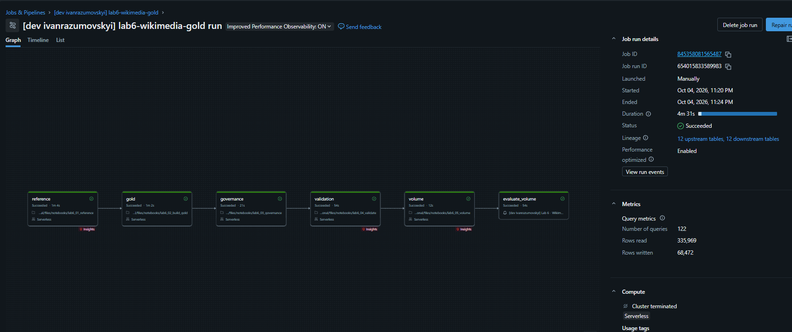

# Lab 6 - Wikimedia Gold layer and business analytics

Gold star schema, AI/BI dashboard, volume-drop alert and row/column security on top of the Lab 5 Wikipedia Silver table.

Business question: **which Wikimedia communities are active, how much editing is automated, and which pages are edited most?**
Metrics describe the captured events, not all Wikimedia traffic.

Lab 5 Silver (`wiki_silver_lab5`) + SiteMatrix snapshot → Job `lab6-wikimedia-gold` (6 tasks) → 12 Delta tables → dashboard, alert, RLS/CLS.

The Gold tables are built by a Lakeflow Job whose tasks are notebooks, and they are written as ordinary managed Delta tables.
This keeps the build simple (small tables, fully recomputed on each run) and allows row filters and column masks to be set directly on the tables.
Lab 5 is only read from, never changed.

The Job `lab6-wikimedia-gold` has six tasks:

| Task | What it does |
|---|---|
| `reference` | loads the SiteMatrix snapshot into `ref_sitematrix_raw` |
| `gold` | builds the dimensions, `fact_edits` and the three aggregates from Silver |
| `governance` | creates the filter and mask functions, attaches them to the tables, grants `SELECT` |
| `validation` | checks keys, foreign keys, reconciliation with Silver and aggregate totals |
| `volume` | records the current row count in `ops_volume_log` |
| `evaluate_volume` | evaluates the SQL alert |

## Star schema

```text
┌──────────────────────┐    ┌──────────────────────┐    ┌──────────────────────┐
│ dim_date             │    │ dim_wiki             │    │ dim_namespace        │
│──────────────────────│    │──────────────────────│    │──────────────────────│
│ PK date_key          │    │ PK wiki_key          │    │ PK namespace_key     │
│ date                 │    │ wiki                 │    │ wiki                 │
│ year                 │    │ language_code        │    │ namespace            │
│ month                │    │ language_name        │    │ namespace_name       │
│ quarter              │    │ project_code         │    └──────────────────────┘
│ day_of_week          │    │ site_name            │
│ day_name             │    │ site_url             │
└──────────────────────┘    └──────────────────────┘
            │                           │                           │
            └───────────────────────────┬───────────────────────────┘        
                                        ▼
┌──────────────────────┐    ┌──────────────────────┐    ┌──────────────────────┐
│ dim_page             │    │ fact_edits           │    │ dim_editor           │
│──────────────────────│    │──────────────────────│    │──────────────────────│
│ PK page_key          │    │ event_id             │    │ PK editor_key        │
│ wiki                 │    │ event_time           │    │ wiki                 │
│ title                │◄───│ bucket_start         │───►│ user_name (masked)   │
│ first_seen           │    │ FK date_key          │    │ first_seen           │
│ last_seen            │    │ FK wiki_key          │    │ last_seen            │
└──────────────────────┘    │ FK namespace_key     │    └──────────────────────┘
                            │ FK page_key          │
                            │ FK editor_key        │
                            │ wiki (for RLS)       │
                            │ bot                  │
                            │ bytes_delta          │
                            │ bytes_added          │
                            │ bytes_removed        │
                            └──────────────────────┘
                                        │
            ┌───────────────────────────┬───────────────────────────┐        
            ▼                           ▼                           ▼
┌──────────────────────┐    ┌──────────────────────┐    ┌──────────────────────┐
│ agg_wiki_5min        │    │ agg_wiki_daily       │    │ agg_page_activity    │
│──────────────────────│    │──────────────────────│    │──────────────────────│
│ wiki_key             │    │ wiki_key             │    │ page_key             │
│ bucket_start         │    │ event_date           │    │ event_date           │
│ edit_count           │    │ edit_count           │    │ edit_count           │
│ editor_count         │    │ editor_count         │    │ editor_count         │
│ bot_share_pct        │    │ bot_share_pct        │    │ bot_share_pct        │
│ net_bytes_delta      │    │ net_bytes_delta      │    │ net_bytes_delta      │
└──────────────────────┘    └──────────────────────┘    └──────────────────────┘
```

Keys are SHA-256 surrogate keys scoped to the wiki (`dim_date` uses `yyyyMMdd`), so the same page title or user name on two wikis never collides.
`bytes_delta = new_length - old_length` is a size change in bytes, not a quality score; unknown lengths stay NULL.

| Table                  | Grain                                                              |
| ---------------------- | ------------------------------------------------------------------ |
| `fact_edits`         | one unique `event_id` (replayed deliveries are deduplicated)      |
| `dim_wiki`           | one observed wiki; language and project from SiteMatrix            |
| `dim_date`           | one UTC date                                                       |
| `dim_namespace`      | one `(wiki, namespace_id)`, names from `siteinfo`               |
| `dim_page`           | one `(wiki, title)`                                               |
| `dim_editor`         | one `(wiki, user_name)`; the name is masked                       |
| `agg_wiki_5min`      | wiki + UTC five-minute bucket                                      |
| `agg_wiki_daily`     | wiki + UTC date                                                    |
| `agg_page_activity`  | page + UTC date                                                    |
| `ref_sitematrix_raw` | one SiteMatrix site (reference snapshot)                           |
| `sec_user_access`    | user + allowed wiki (`*` = all) + permission to see editor names |
| `ops_volume_log`     | one volume measurement per run, used by the alert                  |

Sources and supporting tables: `fact_edits` is built from one pinned version of `wiki_silver_lab5`; `dim_wiki` is joined to `ref_sitematrix_raw` on `wiki = dbname`;
`sec_user_access` feeds the row filter and the column mask; `ops_volume_log` feeds the alert.

## Project layout

| Path                                          | What it is                                                            |
| --------------------------------------------- | --------------------------------------------------------------------- |
| `databricks.yml`                            | Bundle: variables and the `personal` target                          |
| `resources/`                                | Gold job, governance demo job, volume-drop demo job, dashboard, alert |
| `src/lab6/`                                 | Shared code: Gold build, governance, validation, volume log           |
| `notebooks/`                                | One thin notebook per job task                                        |
| `dashboards/`, `tools/build_dashboard.py` | Dashboard JSON and the script that generates it                       |
| `assets/wikimedia.json`                     | SiteMatrix snapshot (fallback for restricted outbound network)        |
| `tests/`                                    | Local Spark tests for the transformations                             |

## Governance

- `wiki_access` is a default-deny row filter on all eight tables that contain `wiki`. It reads `sec_user_access` and `session_user()`.
- `editor_mask` masks `dim_editor.user_name` as `[MASKED]` unless the mapping allows it.
- The bundle variable `reader_principal` (by default the workspace owner) gets `USE CATALOG`, `USE SCHEMA` and `SELECT` on the nine analytical tables only. Reference, access and ops tables are not granted.
- The personal workspace has one user, so enforcement is shown by temporarily changing that user's mapping (`lab6_governance_demo`), not with a second account.

## Dashboard

AI/BI dashboard **Lab 6 - Wikimedia Activity** reads the Gold tables through four datasets (edits, five-minute aggregate, daily aggregate, page aggregate). It has:

- four KPI counters: captured edits, observed editors, edited pages, net size change in bytes;
- a five-minute trend of edits, edits by wiki, bot vs human edits, edits by namespace, top 20 pages and a daily summary;
- four global filters bound to all datasets: date, wiki, language and project.

Times are UTC. The top-20 pages are ranked on the whole capture; the filters narrow that fixed list and do not recompute the ranking.
The dashboard uses the viewer's own data permissions, so row filters and masks apply to whoever opens it.

## Alert

The SQL alert compares the current `fact_edits` row count with the last healthy baseline from `ops_volume_log`. A drop of 50% or more triggers an email.
`lab6_volume_drop_demo` deletes about 90% of the fact rows, evaluates the alert, rebuilds Gold from Silver and evaluates the alert again.
The alert monitors Gold snapshot completeness, not the live Wikimedia edit rate. The owner is the email subscriber, and recovery notifications are on.
Its own hourly schedule is configured but paused; the Job task `evaluate_volume` and the demo job evaluate it.

## Results

The capture used for the screenshots contains 23,843 edits, 3,053 editors and about 19.6k pages (UTC, 4 October 2026).


Dashboard with four KPIs, five-minute trend, wiki ranking, bot share, namespaces, top pages and four global filters (date, wiki, language, project):


Same dashboard filtered by `Language: de`:


Gold job, all six tasks succeeded:



Email from the volume-drop alert (`TRIGGERED`):


RLS and CLS check on the full capture: 23,843 rows -> 7,826 rows for one wiki, 340 masked editors, 0 rows without a mapping:


## Reproducibility

For Azure Dev resource creation without executing notebooks or evaluating alerts,
see [AZURE_DEPLOY.md](AZURE_DEPLOY.md). The `azure_dev` target follows Lab 5's
workspace/catalog and classic compute configuration; its SQL warehouse ID must
be supplied at deployment time.

- SiteMatrix is stored as a snapshot (`assets/wikimedia.json`) in a Unity Catalog volume, because outbound network access is restricted in Free Edition. The Job can also refresh it from the public API.
- Gold reads one pinned Delta version of Silver, recorded as the `lab6.source_version` property of `fact_edits`, so validation compares against exactly the data that was used.
- Everything (job, demo jobs, dashboard, alert) is defined in the bundle and deployed with `databricks bundle deploy -t personal`.

## Local tests

```bash
pip install -r requirements-dev.txt
python tests/test_transforms.py
```

The tests cover replay deduplication, wiki-scoped keys, UTC bucket boundaries, signed and missing byte changes, distinct-editor counts and reference parsing.
Remote validation (task `validation`) checks key uniqueness, foreign keys, reconciliation with the pinned Silver version and aggregate totals.
