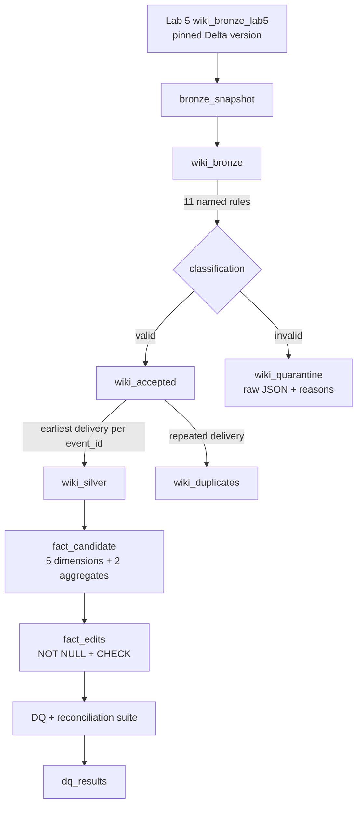
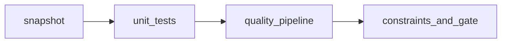
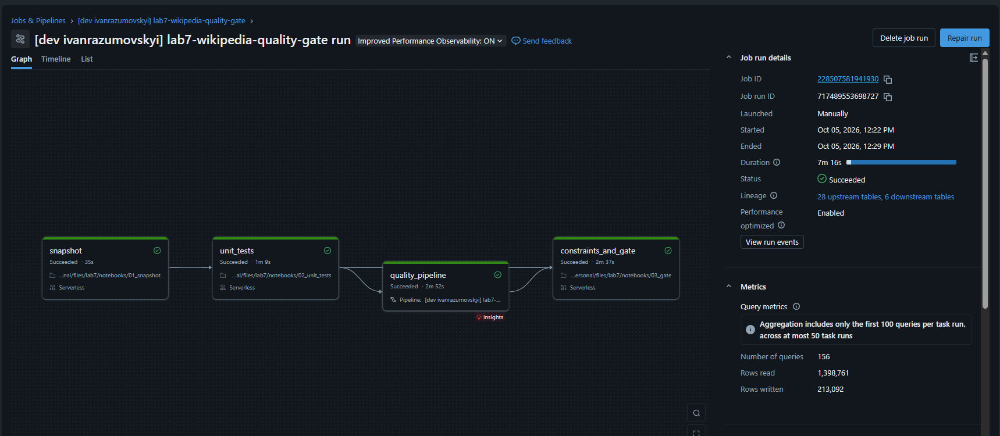
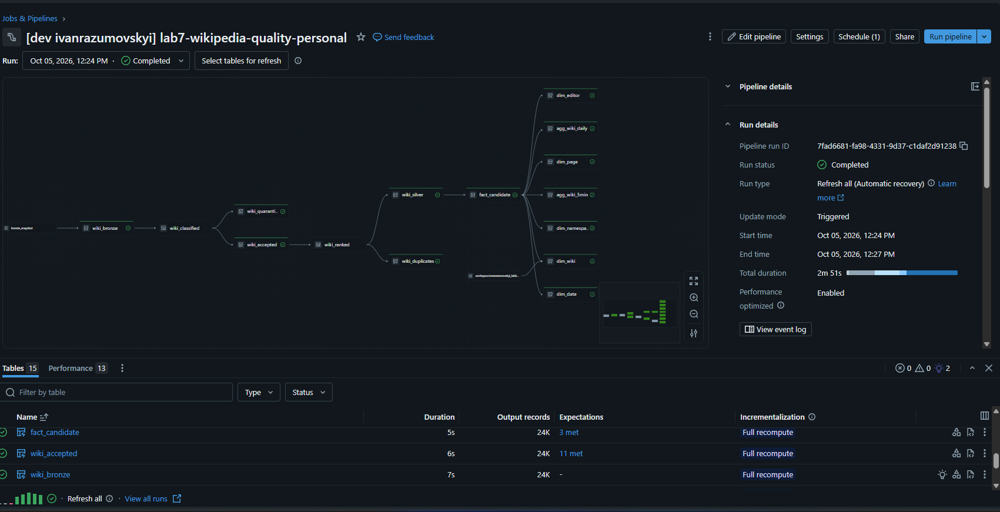
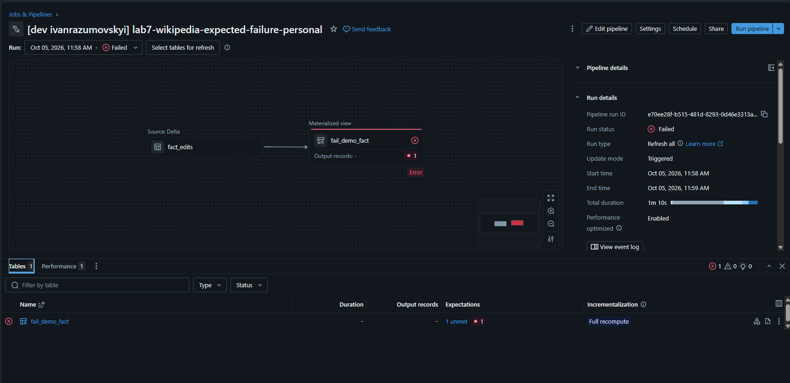

# Lab 7 - Data quality testing and unit tests

Unit tests for the Wikipedia transformations, and a data-quality suite over the medallion: Lakeflow expectations, a quarantine table, Delta constraints, DQX checks and reconciliation between layers.
The suite runs as a headless Job that fails when mandatory checks fail, and the unit tests run in GitHub Actions on local Spark.

Only Wikipedia is used. Lab 5 Bronze is read at one pinned Delta version, and the Lab 5 and Lab 6 transformation modules are reused.
All Lab 7 output goes to its own schema, `ivanrazumovskyi_lab7`.

Lab 5 Bronze (pinned version) → Job `lab7-wikipedia-quality-gate` (4 tasks) → quality pipeline, constrained `fact_edits`, `dq_results`.

## Flow

### Data



### Job



The Job `lab7-wikipedia-quality-gate` runs these four tasks in sequence. A mandatory check that fails in the last task fails the Job.
Before its first run, execute the separate `lab7-wikipedia-setup` Job.
Setup creates the schema and constrained fact table without reading `fact_candidate`:
the schema is derived from empty Wikipedia transformations. Setup reruns preserve data.
Run setup again when provisioning a new environment or installing missing constraints;
an incompatible existing fact schema requires an explicit migration.

| Task | What it does |
|---|---|
| `snapshot` | copies the pinned Lab 5 Bronze version into `bronze_snapshot`, records it in `snapshot_manifest`, saves rejected demo rows to `wiki_quarantine_demo` |
| `unit_tests` | runs the pytest suite against the Job's own Spark session |
| `quality_pipeline` | Lakeflow pipeline: classification, quarantine, deduplication, fact, dimensions, aggregates |
| `constraints_and_gate` | publishes `fact_edits` with constraints, proves invalid inserts are rejected, runs all checks, writes `dq_results`, raises on mandatory failures |

A separate pipeline, `lab7_fail_demo`, is a deliberate negative test that runs on demand.

## Part A - Unit tests

The transformations are importable modules, shared by the pipeline, the notebooks and the tests:

| Module | Content |
|---|---|
| `lab5/src/lab5/transforms.py`, `lab6/src/lab6/transforms.py` | JSON parsing, fallback event ID, quality annotation, wiki-scoped keys, UTC buckets, byte measures, aggregates |
| `src/lab7/quality.py` | rules, pure classification, deduplication ranking, fact and dimension builders, reference join, reconciliation, freshness |
| `src/lab7/checks.py` | tested DQ groups and report summary, with explicit DataFrames, clock and DQX engine |
| `src/lab7/dqx_checks.py` | DQX checks built from the same rules |
| `src/lab7/constraints.py` | shared fact contract, setup schema derivation and tested structured-error helpers |
| `src/lab7/source_validation.py` | tested reconciliation of supplied Gold and pinned Silver DataFrames |
| `src/lab7/tables.py` | small write helper reused by the notebooks |

Task-specific reads and writes, and the explicit sequence of check groups, remain in notebook cells.
The same check functions are called directly by pytest; no check function loads or writes tables.
Common widget parameters use `notebook_config()`; each notebook keeps a short path bootstrap.
`00_setup.py` provisions infrastructure, `01_snapshot.py` freezes and inspects data,
and `03_gate.py` publishes fact, tests rejected writes and runs each DQ group.
There is no `runtime.py` or notebook that delegates the whole task to `run_suite()`.

Tests call the same DQ groups used by `03_gate.py`, including failures for missing deliveries,
orphan keys, corrupt aggregates, DQX violations and late events. They also verify summary
severity and the shared negative-write expressions.

The tests (`tests/`) cover JSON parsing and malformed payloads, rejection reasons, branch accounting, deduplication, wiki-scoped keys, UTC bucket boundaries, nullable byte measures, reference joins, aggregates, freshness boundaries, constraint-error handling and the failing gate.
Nine synthetic records (six invalid, two valid, one repeated delivery) run inside pytest and in `wiki_quarantine_demo`.

One suite, three ways to run it:

```bash
# 1. Local Spark (Java 17, Python 3.12); the same command runs in CI
uv venv --python 3.12 lab7/.venv
uv pip install --python lab7/.venv/bin/python -r lab7/requirements-ci.txt
TZ=UTC SPARK_LOCAL_IP=127.0.0.1 lab7/.venv/bin/python -m pytest -c lab7/pytest.ini lab7/tests

# 2. Local pytest against remote Spark through Databricks Connect (personal serverless)
uv venv --python 3.12 lab7/.venv-connect
uv pip install --python lab7/.venv-connect/bin/python -r lab7/requirements-connect.txt
TZ=UTC LAB7_SPARK_BACKEND=connect lab7/.venv-connect/bin/python -m pytest -c lab7/pytest.ini lab7/tests

# 3. Headless, through the bundle
cd lab7
databricks bundle validate --strict -t personal
databricks bundle deploy -t personal
databricks bundle run lab7_setup_job -t personal
databricks bundle run lab7_quality_job -t personal
```

`conftest.py` selects the Spark session from `LAB7_SPARK_BACKEND` (`local`, `connect` or `runtime`).
Databricks Connect has its own environment.
For debugging, select `.venv-connect` as the interpreter and run `tools/debug_connect.py` with a breakpoint on the classification step: the Python code runs locally, Spark actions run remotely. A VS Code launch template is in `ide/launch.json`.

Connect runs against the serverless compute of the personal workspace.

## Part B - Data quality

### Dimensions

| Dimension | Checks | Action on violation |
|---|---|---|
| Completeness | event ID, title, user, wiki, namespace and all fact keys are present | invalid source rows go to quarantine; a missing trusted key fails the gate |
| Uniqueness | event IDs in Silver and fact, keys in each dimension | earliest delivery kept, repeats saved in `wiki_duplicates`; a residual duplicate fails the gate |
| Validity | parseable JSON and timestamp, event type `edit`, wiki identifier format, non-negative lengths | dropped from `wiki_accepted`, kept in `wiki_quarantine` with the rule names |
| Consistency | `bytes_delta = bytes_added - bytes_removed`, fact → dimension references, wiki → SiteMatrix reference, layer reconciliation, Lab 6 Gold totals | fact invariants fail the pipeline, the rest fails the gate |
| Timeliness | every delivery arrives 0-3600 s after its event time; snapshot age; age of the source | delivery violations and snapshot age fail the gate, historical source age is a warning |

`old_length` and `new_length` may be missing: the derived byte measures then stay NULL. SQL NULL in a predicate counts as a failure.

### Lakeflow gates and quarantine

The accepted branch uses `expect_all_or_drop` with all 11 named rules, so every rule has its own counter in the pipeline UI and event log.
Rejected rows go to `wiki_quarantine` with the raw JSON, Kafka coordinates, `_quality_errors` and the snapshot ID. `fact_candidate` uses `expect_all_or_fail` on the fact invariants.
`wiki_quarantine_demo` holds six persisted rejected synthetic examples with raw JSON and reasons.

### Delta constraints

`fact_edits` is a regular Delta table provisioned by the separate setup Job and refreshed by the gate task using INSERT OVERWRITE, which retains constraints. It has NOT NULL on the keys and `edit_count`, and CHECK constraints `one_edit`, `lengths_nonnegative` and `bytes_consistent`.
The gate task inserts four invalid rows (NULL `event_id`, `edit_count = -1`, negative `old_length`, inconsistent `bytes_delta`). Each is rejected with the expected structured Delta error and constraint name, and the row count stays the same.

### DQX

`src/lab7/dqx_checks.py` uses Databricks Labs DQX 0.16.0. The shared rules become named DQX checks; `is_unique` and `foreign_key` validate the fact and its five dimensions.
DQX runs in the gate and the integration tests. Failed fact rows are saved to `dqx_fact_quarantine` (empty on healthy data) before the gate raises.

### Reconciliation

```text
Bronze = Silver + Quarantine + Duplicates
Silver = Fact
SUM(edit_count) of each aggregate = COUNT(fact)
SUM(bytes_added, bytes_removed, net_bytes_delta) of each aggregate = the same sums over fact
```

Deliveries are also compared as a multiset on their Kafka coordinates, so equal totals cannot hide one lost and one extra row. The Lab 6 Gold validation is run against its pinned Silver version as well.
The source-table reads and pinned-version selection are visible in `03_gate.py`.
The frame-level check is in `lab7.source_validation`; its tests cover lost rows,
duplicate events, orphan keys and corrupted aggregate and byte measures.

### Gate and results table

The suite writes every check to `dq_results` (check, dimension, severity, observed, expected, details) before raising, so a failed run can still be inspected.
Mandatory failures fail the Job; warnings do not. `sql/inspect_quality.sql` shows the checks, quarantine reasons, duplicates and the table DDL.

### Negative test

```bash
databricks bundle run lab7_fail_demo -t personal
```

The pipeline `lab7_fail_demo` sets one edit count to -1 and must fail on `one_edit`.

## Tables

| Table | Content |
|---|---|
| `bronze_snapshot`, `snapshot_manifest` | pinned copy of Lab 5 Bronze and its provenance (version, ID, row count) |
| `wiki_bronze`, `wiki_accepted`, `wiki_silver` | pipeline layers |
| `wiki_quarantine`, `wiki_duplicates` | rejected rows with reasons, repeated deliveries |
| `fact_candidate`, `dim_wiki`, `dim_page`, `dim_editor`, `dim_namespace`, `dim_date`, `agg_wiki_daily`, `agg_wiki_5min` | fact, dimensions, aggregates |
| `fact_edits` | constrained Delta table that the gate validates |
| `dq_results`, `dqx_fact_quarantine` | check results, rows rejected by DQX |
| `wiki_quarantine_demo` | six persisted synthetic rejections |

## Results

Lab 5 Bronze version 27, personal workspace:

```text
23,844 Bronze = 23,843 Silver + 0 Quarantine + 1 Duplicate
23,843 Silver = 23,843 Fact rows
```

- The one duplicate is a repeated real event. All 11 rules passed for all 23,844 deliveries, so the real quarantine is empty.
- The suite ran 63 checks: 62 mandatory checks passed, and one warning reports the age of the historical source.
- Delivery delay: 0 violations, minimum 425 s, maximum 3,010 s, p95 2,882 s.
- All four invalid inserts were rejected with the expected constraint; the fact kept 23,843 rows.
- `lab7_fail_demo` failed on `one_edit`, as intended.
- Dimension keys are unique, all fact references resolve, and the Lab 6 Gold reconciliation passed.
- The separate setup Job and all 63 local/headless tests passed. First table creation
  and repeated setup were verified without requiring a pipeline-owned candidate table.

The [current Job run](https://dbc-ab9a5afe-c151.cloud.databricks.com/jobs/228507581941930/runs/381144064412640?o=7474655630219513)
succeeded on the first attempt: snapshot, all 63 tests, pipeline and gate.
The screenshot below shows the same four-task layout from an earlier run:



Quality pipeline graph with the expectations: `wiki_accepted` met all 11 rules and `fact_candidate` met its 3 fact invariants (about 24K records each):



Negative test `lab7_fail_demo`: the pipeline fails on purpose, with one unmet expectation (`one_edit`):



## Project layout

| Path | What it is |
|---|---|
| `databricks.yml` | Bundle: variables and the targets `personal` and `azure_dev` |
| `resources/` | Separate setup Job, quality Job, quality pipeline, negative-test pipeline |
| `src/lab7/` | Rules, pure transformations, DQX checks, tested helpers and shared contracts |
| `pipeline/` | Lakeflow pipeline source and the negative-test pipeline |
| `notebooks/` | Setup and readable task workflows split into named cells |
| `tests/` | pytest suite |
| `tools/` | Debugging and inspection helpers |
| `sql/inspect_quality.sql` | Queries over the quality tables |
| `ide/launch.json` | VS Code debug template |

## Targets

| Target | Workspace / compute | Catalog.schema |
|---|---|---|
| `personal` | Free Edition (profile `personal-env`), serverless | `workspace.ivanrazumovskyi_lab7` |
| `azure_dev` | Azure Dev, classic compute | `dbr_dev.ivanrazumovskyi_lab7` |

The `azure_dev` target is deployed with:

```bash
cd lab7
databricks bundle validate --strict -t azure_dev
databricks bundle deploy -t azure_dev
```

## CI

`.github/workflows/lab7-ci.yml` installs `requirements-ci.txt`, runs Ruff (including unused imports and the 100-character line limit), and runs the pytest suite on local Spark for pushes, pull requests and manual runs.
The checks against the real tables run in the headless Job.
